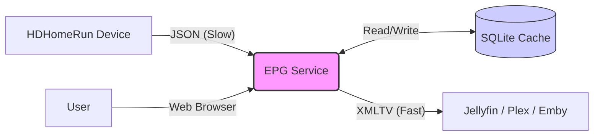
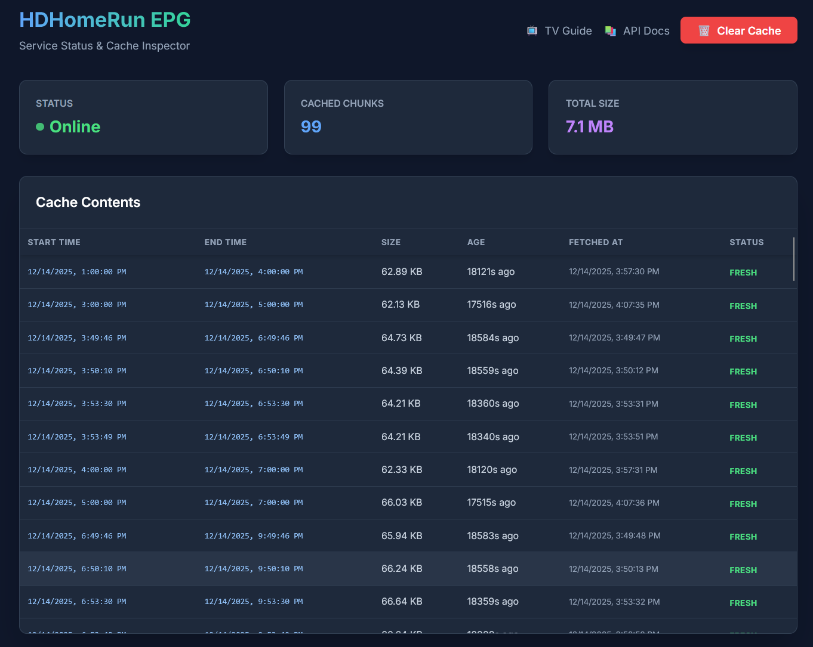
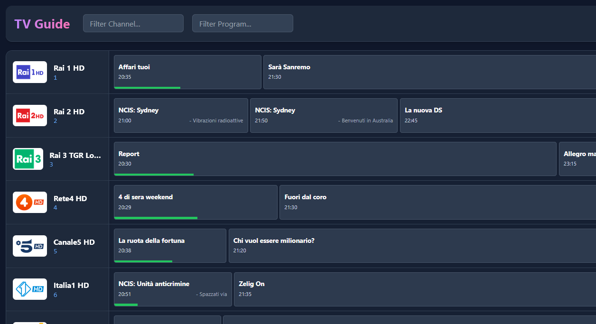
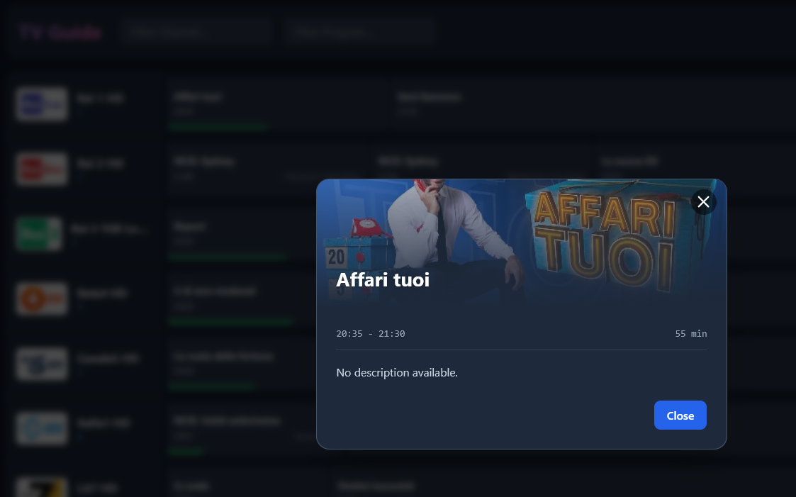
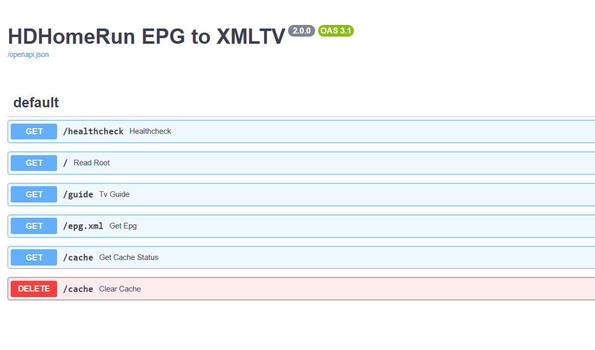

# HDHomeRun EPG to XMLTV


Refactored Python library and FastAPI service to fetch EPG from HDHomeRun devices and serve it as XMLTV.

## ✨ Features

**For Media Server Users (Jellyfin, Plex, Emby):**
*   📺 **Free EPG Data**: Extracts the over-the-air guide data that comes with your TV signal. No paid subscriptions needed!
*   🔌 **Plug & Play**: Acts as a simple bridge. Point your media server to `http://.../epg.xml` and you're done.
*   🚀 **Performance**: Caches data locally so your automated guide updates in Jellyfin finish in seconds, not minutes.
*   👀 **Web Interface**: Includes a beautiful built-in TV Guide to check what's on without opening your media player.

**Technical Highlights:**
*   🐍 **Modern Stack**: Built with Python 3.9+ and FastAPI.
*   💾 **Smart Caching**: SQLite-based caching with 24h TTL to minimize calls to the HDHomeRun hardware.
*   🐳 **Docker First**: Ready-to-use container for easy deployment.
*   🔍 **Observability**: Prometheus-ready metrics and detailed logs.

## 🔄 How It Works

This service acts as a proxy and translator between your hardware and your media server.



1.  **Discovery**: Finds your HDHomeRun device on the local network.
2.  **Fetch & Cache**: Downloads the schedule in small chunks and saves it to a local database.
3.  **Serve**: Generates a standard `epg.xml` file that any XMLTV-compatible software can ingest.


## 📊 Project Status

-   **Completed**: Refactoring, Caching, Dashboard, Guide UI, Testing, Docker.
-   **Deployment**: [Deployment Guide](DEPLOY.md) (Helm, ArgoCD, FluxCD).
-   **Next Steps**: Authenticated endpoints (optional), multiple device support (optional).


## 📸 Screenshots

### Dashboard


### TV Guide




*(Detailed program view)*

### API Documentation


## 🚀 Usage


### 🐳 Docker (Recommended)

One official Docker image is available at `ghcr.io/thekoma/hdhomerunepgxml`.

Run the service using Docker Compose:


```bash
docker compose up --build -d
```

The XMLTV file will be available at:
`http://localhost:8000/epg.xml`

### ⚙️ Configuration

The application is fully configurable via Environment Variables.

| | Variable | Default | Description |
|-------|----------|---------|-------------|
| 🏠 | `HDHOMERUN_HOST` | `hdhomerun.local` | IP or Hostname of your HDHomeRun device. |
| 📅 | `HDHOMERUN_EPG_DAYS` | `4` | Number of days of EPG data to fetch. |
| ⏱️ | `HDHOMERUN_EPG_HOURS` | `2` | Size of each fetch chunk in hours. Smaller chunks = more granular caching. |
| 🐛 | `HDHOMERUN_DEBUG_MODE` | `on` | Enable detailed debug logging. |
| 💾 | `HDHOMERUN_CACHE_ENABLED`| `True` | Set to `False` to completely disable caching. |
| 📦 | `HDHOMERUN_CACHE_DB_PATH`| `epg_cache.db` | Path to the SQLite cache file. |
| ⏳ | `HDHOMERUN_CACHE_TTL_SECONDS`| `86400` | How long (in seconds) to keep cached data (Default: 24h). |

### ⚡ API Endpoints

| Method | Endpoint | Description |
|--------|----------|-------------|
| `GET` | `/` | **Responsive Root**. Returns **Dashboard (HTML)** for browsers or **Status (JSON)** for API clients. |
| `GET` | `/guide` | **TV Guide**. Visual TV Guide showing programs for the next 24 hours. |
| `GET` | `/epg.xml` | **Main Endpoint**. Fetches and returns the generated XMLTV file. |
| `GET` | `/healthcheck` | **Liveness**. Returns `{"status": "ok"}`. |
| `DELETE`| `/cache` | **Maintenance**. Manually clears the entire local cache. |

### 🛠️ Local Development

1. Install dependencies:
   ```bash
   pip install -r requirements.txt
   ```

2. Run the service:
   ```bash
   uvicorn app.main:app --reload
   ```


## 🙏 Credits

This project is a fork and modernization of [HDHomeRunEPG-to-XmlTv](https://github.com/IncubusVictim/HDHomeRunEPG-to-XmlTv) by @IncubusVictim.
The original reverse engineering and core logic provided the critical foundation for this application.
